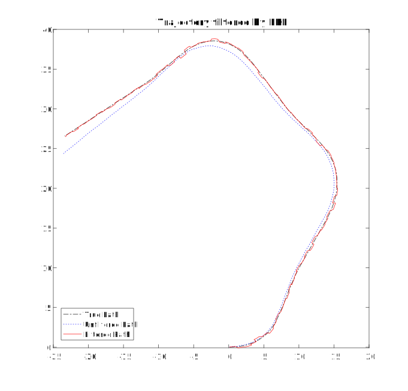
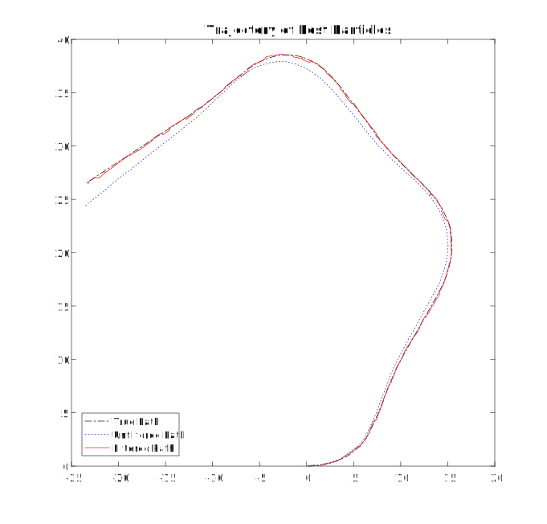
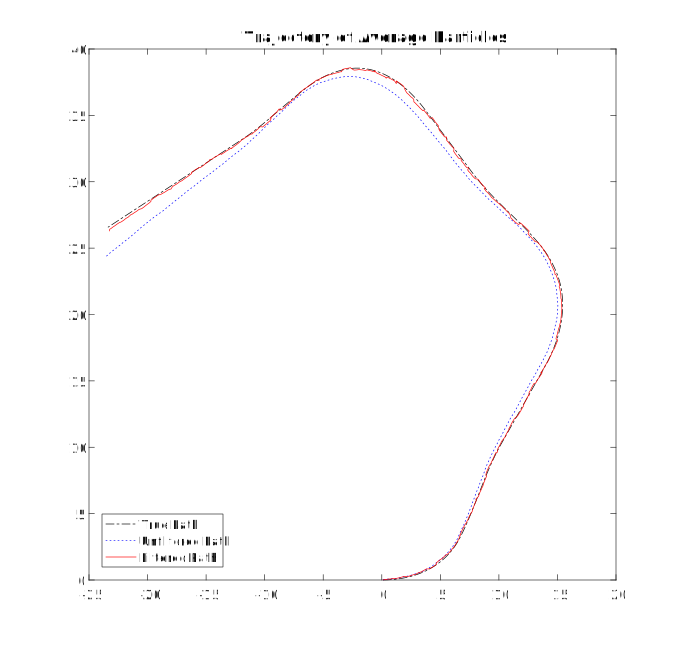
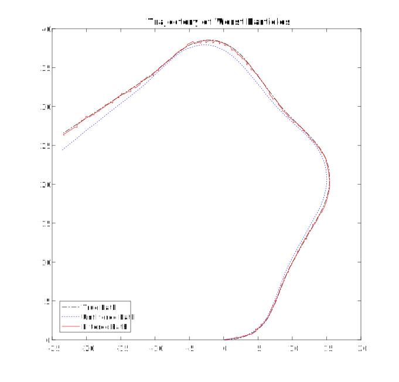

# PF_vs_EKF_for_Landmark_Localization
Performance Comparison of Particle Filter and Extended Kalman Filter for Landmark-based Localization, implemented in Matlab.

## Summary
This work is my assignment in the course Artificial Intelligence, taught by Dr. Cuong Pham-Viet.

## Results
<p align="center">
  
  
</p>
<p align="center">
  
  
</p>

<p align="center">
First Header | Second Header
------------ | -------------
Content from cell 1 | Content from cell 2
Content in the first column | Content in the second column
</p>

```
             error_x     error_y     error_theta
-------------------------------------------------
error_odo    0.612770    0.815380    0.434710
error_max    0.076751    0.086025    0.012091
error_avg    0.077178    0.106180    0.012687
error_min    0.090608    0.130630    0.015909
error_ekf    0.136460    0.108730    1.302300
```
